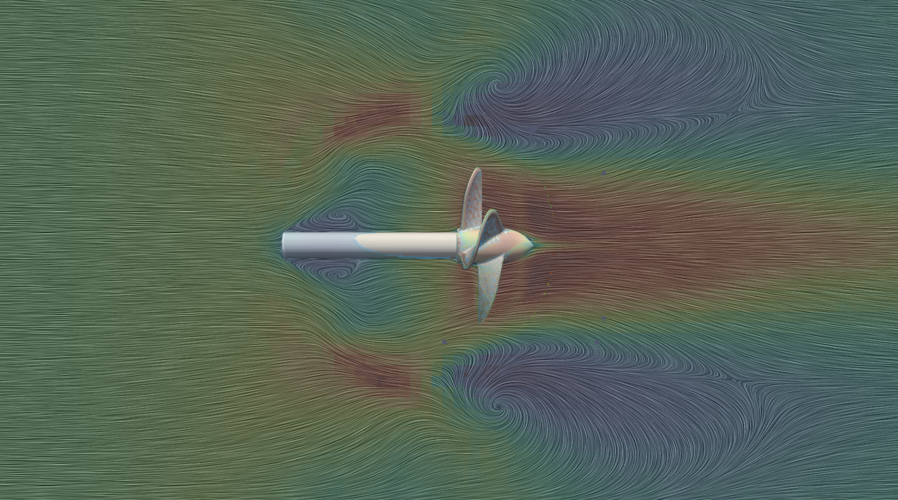
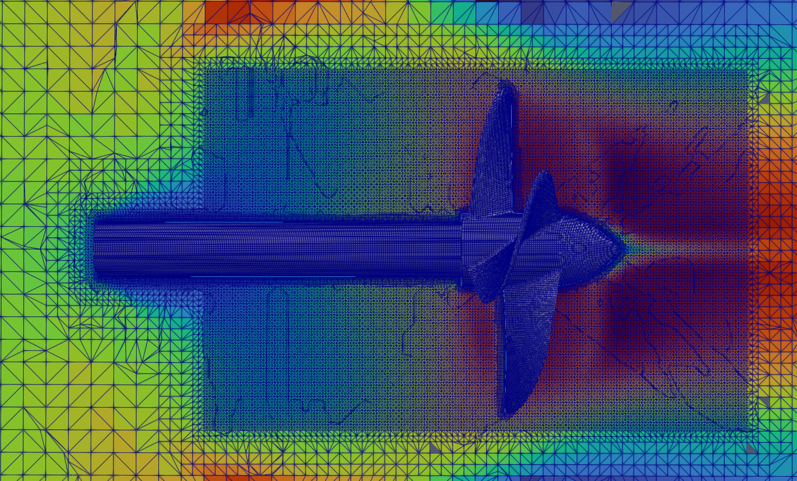
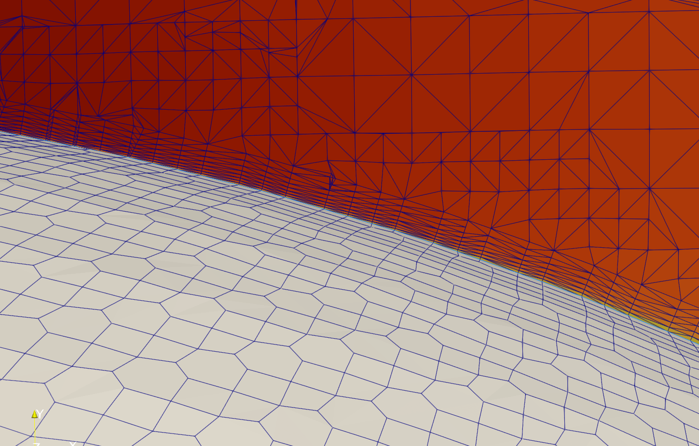

# marine-propeller-simulation
Simulated a marine propeller operating in water using two CFD solvers: OpenFOAM (MRF approach) and STAR-CCM+ (Rigid Body Motion)..

### Velocity Contours and Streamlines

### Mesh Refinement Overview

### Near-Wall Boundary Layer Mesh

### Mesh Setup
- Base mesh generated with **snappyHexMesh**.
- Local refinement around the propeller up to **level 5**.
- **8 prism layers** extruded on the rotor surface with an expansion ratio of **1.2**.
- Estimated first cell height ≈ **4×10⁻⁵ m** (y⁺ ≈ 1–5 in water).
- Refinement region defined by a cylindrical zone (`rotorCyl`) of radius 0.4 m.

### Flow Field Structure
- **Velocity contours** show smooth acceleration through the propeller disk, with a coherent wake region extending several diameters downstream.  
- The near-wall mesh resolution (first-cell height ≈ 4×10⁻⁵ m) allowing accurate capture of boundary-layer behavior.

## STAR-CCM+ Simulation

### Overview
This simulation models the **transient startup of a marine propeller in water** using the **Rigid Body Motion (RBM)** approach in STAR-CCM+.  
The propeller accelerates from rest to its steady-state rotational speed over **2.35 seconds**, capturing the unsteady wake development and vortex roll-up behind the blades.

---

### Mesh and Model Details
- Mesh type: **Trimmed with prism layers**
- **Total prism-layer thickness:** 0.004 m  
- **Number of prism layers:** 14  
- **First-layer thickness:** 1×10⁻⁵ m
- **Overset mesh configuration:**
  - *Background (FV, index 1):* 4,225,216 cells, 12,719,880 faces, 4,320,671 vertices  
  - *Rotor region (index 2):* 4,103,849 cells, 12,203,558 faces, 4,161,858 vertices  
- Total mesh size: **~8.3 million cells**

---

### Figures
- **Figure 1:** Rotor and overset interface with velocity contours (`Star_Mesh1.png`)  
- **Figure 2:** Near-wall region showing resolved prism-layer mesh (`Star_Mesh2.png`)

[Watch the transient startup (0–2.35 s) on YouTube](https://www.youtube.com/watch?v=R2ZKZAD3UWo)
---

### Key Notes
- The simulation used the **Segregated Flow Solver** with **k–ω SST turbulence model**.  
- The overset region (rotor) was allowed to rotate freely via RBM, accurately capturing transient wake development.  
- The flow field shows formation of **tip vortices** consistent with the OpenFOAM MRF results in structure and strength.  
- Thrust converged to approximately **–4506 N**, matching the OpenFOAM MRF solution within 7%.

### Force Predictions
- The propeller produced a **steady thrust of approximately –4506 N** along the x-axis (propeller axis).  
- This value closely matches the **STAR-CCM+ RBM simulation (~–4200 N)**, demonstrating excellent agreement between the steady MRF and transient RBM approaches (difference ≈ 7%).  
- Lateral forces (Fy, Fz) remained below **±5 N**, confirming minimal side loading and good rotor alignment.  
- The predicted moment about the rotation axis was approximately **–1000 N·m**, consistent with expected propeller torque.

### Comparison Summary
| Parameter | OpenFOAM (MRF) | STAR-CCM+ (RBM) | Comment |
|------------|----------------|-----------------|----------|
| Thrust (N) | 4506 | 4520 | Excellent agreement |
| Torque (N·m) | ~735 |
| Tip-vortex structure | Q ≈ 1×10⁶ | Similar | Qualitative match |

### Figures
- **Figure 1:** Mid-plane velocity contours with streamlines (`Rotor_Contour.png`)  
- **Figure 2:** Mesh refinement and velocity contours near the rotor (`Rotor_mesh1.png`)  
- **Figure 3:** Near-wall mesh showing boundary-layer resolution (`Rotor_mesh2.png`)

