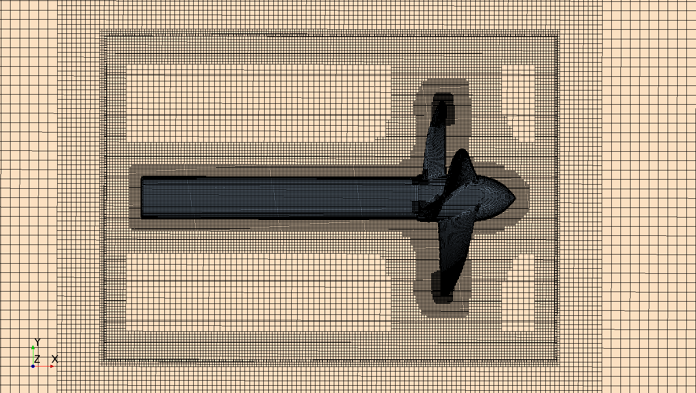
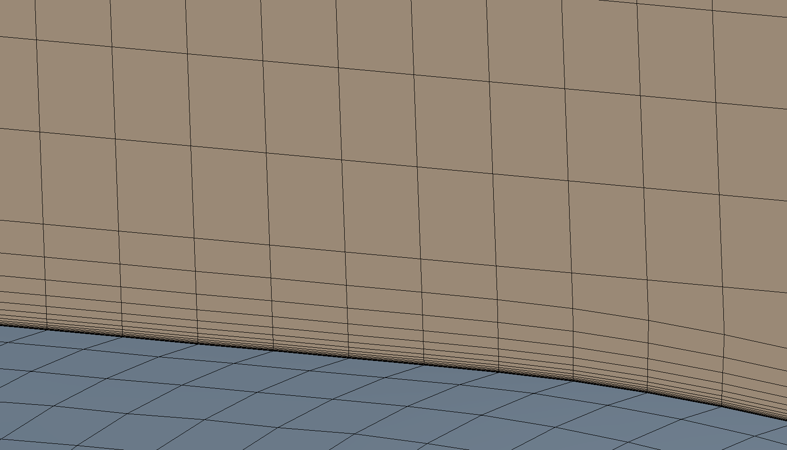

# marine-propeller-simulation
Simulated a marine propeller operating in water using two CFD solvers: OpenFOAM (MRF approach) and STAR-CCM+ (Rigid Body Motion)..

-Free stream conditions: 2 m/s inlet

-Spin rate of the Propeller: 42 rad/s

-Medium: Water, ρ: 1000 kg/m3

-D=0.72 m (diameter) (radius R=0.36 m)

### Velocity Contours and Streamlines

### Mesh Refinement Overview

### Near-Wall Boundary Layer Mesh

### Mesh Setup
- Base mesh generated with **snappyHexMesh**.
- **8 prism layers** extruded on the rotor surface with an expansion ratio of **1.2**
- Estimated first cell height ≈ **4×10⁻⁵ m** (y⁺ ≈ 1–5 in water).
- Note: The boundary layer resolution represents the best achievable configuration in SnappyHexMesh before layer generation failed. Some regions of the mesh fall within the log-law region.
- Refinement region defined by a cylindrical zone (`rotorCyl`) of radius 0.4 m.

### Flow Field Structure
- **Velocity contours** show acceleration through the propeller disk, with a coherent wake region extending several diameters downstream.  
- The near-wall mesh resolution (first-cell height ≈ 4×10⁻⁵ m) allowing accurate capture of boundary-layer behavior.

## STAR-CCM+ Simulation

### Overview
This simulation models the **transient startup of a marine propeller in water** using the **Rigid Body Motion (RBM)** approach in STAR-CCM+.  
The propeller is given a steady-state rotational speed over **2.35 seconds**, capturing the unsteady wake development and vortex roll-up behind the blades.

---

### Mesh and Model Details
- Mesh type: **Trimmed with prism layers**
- **Total prism-layer thickness:** 0.004 m  
- **Number of prism layers:** 14  
- **First-layer thickness:** 1×10⁻⁵ m
- **Overset mesh configuration:**
  - *Background mesh * 4,225,216 cells
  - *Rotor region * 4,103,849 cells
- Total mesh size: **~8.3 million cells**

---

### Figures
- **Figure 1:** Rotor and overset interface with velocity contours (`Star_Mesh1.png`)  
- **Figure 2:** Near-wall region showing resolved prism-layer mesh (`Star_Mesh2.png`)

---

### Key Notes
- The simulation used the **Segregated Flow Solver** with **k–ω SST turbulence model**.  
- The overset region (rotor) was allowed to rotate freely via RBM, accurately capturing transient wake development.  
- Thrust converged to approximately **–4520 N**, closley matching the OpenFOAM MRF solution.

### Force Predictions
- in **OpenFOAM The propeller produced a **steady thrust of approximately –4506 N** along the x-axis (propeller axis).  
- This value closely matches the **STAR-CCM+ RBM simulation (~–4520 N)**, demonstrating excellent agreement between the steady MRF and transient RBM approaches.  
- Lateral forces (Fy, Fz) saw spikes up to 400 N for the RBM cases.  

### Comparison Summary
| Parameter | OpenFOAM (MRF) | STAR-CCM+ (RBM) | Comment |
|------------|----------------|-----------------|----------|
| Thrust (N) | 4506 | 4520 | Excellent agreement |
| Tip-vortex structure | Q ≈ 1×10⁶ | Similar | Qualitative match |
Torque (N·m) | ~735 for both simulations

Vtip​=ωR=42×0.36=15.12m/s
Advance ratio J≈0.42
CT​=ρn2D4T​,n=2πω​
Ct = 0.375 (thrust coefficient)

### Rotor Simulation (click to see video)

